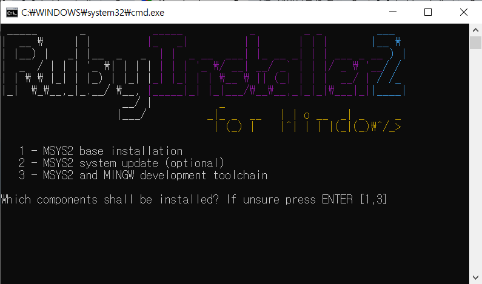

# 코드 저장소  
개발 블로그

Based on Minimal Mistakes Jekyll theme.  
→ [README-minimal-mistakes-jekyll-theme.md](README-minimal-mistakes-jekyll-theme.md)

## 개발 환경  
- Visual Studio Code  
- Typora  
- GitHub Desktop  
- rubyinstaller devkit 3.4.5-1-x64
https://rubyinstaller.org/downloads/  

3번 MSY32 and MINGW development toolchain

gem install jekyll
gem update --system
gem install bundler
bundle install
bundle exec jekyll serve
bundle add webrick

Gem version 3.7.1
Bundler version 2.7.1

## 메모  
- **Typora**: 이미지를 쉽게 추가할 수 있음.

- Sass Deprecation Warning 해결 (선택)
Minimal Mistakes 테마가 Sass 최신 문법을 아직 반영하지 않아 경고가 많습니다.
기능상 문제는 없지만 미래를 위해 아래와 같이 할 수 있어요:

@import → @use, @forward로 마이그레이션

/ 나눗셈 → math.div() 함수로 대체

하지만 지금은 무시해도 OK입니다! (Jekyll 4.x + Minimal Mistakes에선 흔한 현상)

## 참고자료  
- https://mmistakes.github.io/minimal-mistakes/docs/quick-start-guide/
- https://jekyllrb.com/docs/
- https://teddynote.github.io/
- https://github.com/teddynote
- https://typora.io/
- https://desktop.github.com/download/

